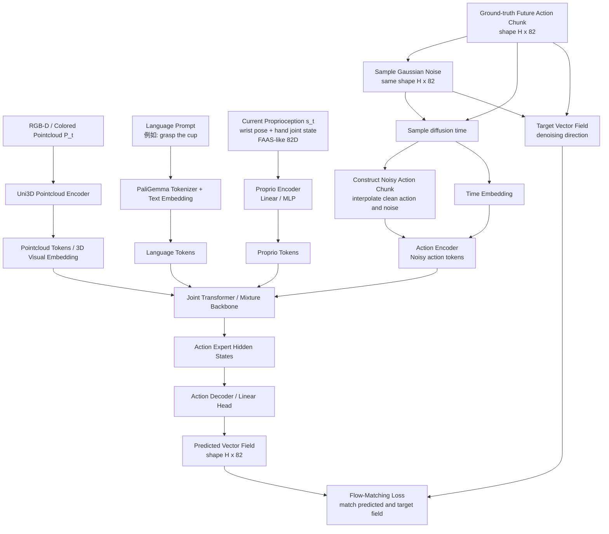
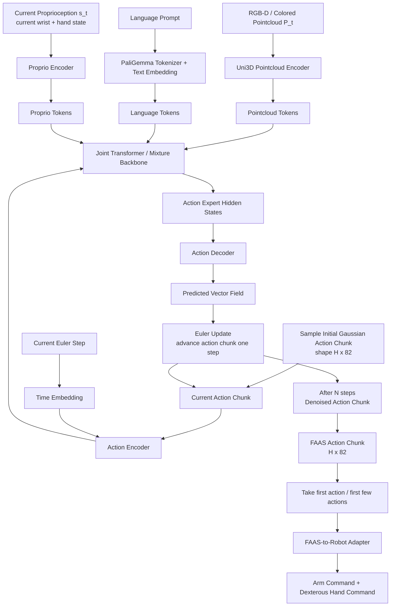
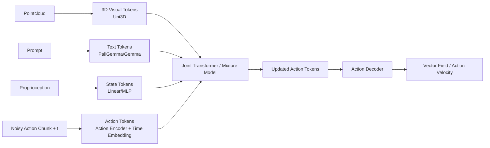
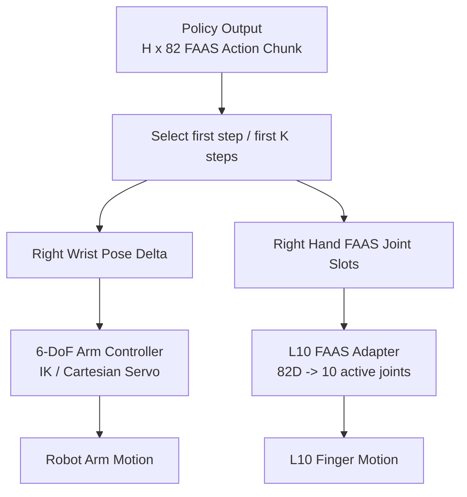

# UniDex L10 特调版

UniDex-VLA 动作生成部分的一份简化说明：模型同时接收点云、语言指令和机器人自身状态，在统一的 FAAS 动作空间中预测未来一段动作。

## 模型输入

模型在时刻 `t` 的输入由三部分组成：

- `Point cloud`：由 `Uni3D` 编码，再通过 projector 对齐到 `PaliGemma/Gemma` 的 hidden size。
- `Language instruction`：直接使用 `PaliGemma/Gemma` 的文本 embedding。
[!NOTE]PaliGemma/Gemma需要微调
- `Proprioception`：机器人当前本体状态，通过 `Linear(proprio_dim=82 -> hidden=1024)` 投影到隐藏空间。

## 动作是怎么建模的

UniDex-VLA 不是直接预测单步动作，而是一次预测未来 `H` 步组成的 `action chunk`：

`A_t = [a_t, ..., a_{t+H-1}]`

训练时，模型不会直接看干净动作 `A_t`，而是先构造一个带噪版本：

`A_t^τ = τ A_t + (1 - τ) ε, 其中 ε ~ N(0, I), τ ∈ [0, 1]`

这里的直觉是：让模型学会如何把一段“被噪声污染过的未来动作”逐步拉回真实动作轨迹，而不是一次性硬回归出最终答案。

具体来说：

- `ActionEncoder(action_dim=82 -> hidden=1024)` 先把 FAAS 空间中的动作表示编码成动作 token。
- `timestep embedding` 用来注入当前时间步/噪声强度 `τ`，告诉模型现在处在去噪过程的哪个阶段。
- 当前观测 `o_t = [P_t, l_t, q_t]` 和带噪动作块 `A_t^τ` 一起送入主干网络，学习条件向量场 `v_θ(A_t^τ, o_t)`。
- 监督目标不是直接回归动作值，而是逼近论文中的去噪方向 `u(A_t^τ | A_t) = A_t - ε`。

## 主干网络与输出

上面的多模态 token 和动作 token 会一起进入 `Joint Transformer / mixture model`，得到动作相关的隐藏状态 `action hidden states`。

最后，模型通过一层线性投影：

`Linear(hidden=1024 -> action_dim=82)`

把隐藏状态映射回 FAAS 动作空间，输出对应的 `action velocity`。

训练过程

推理过程

总体过程

对于该项目

